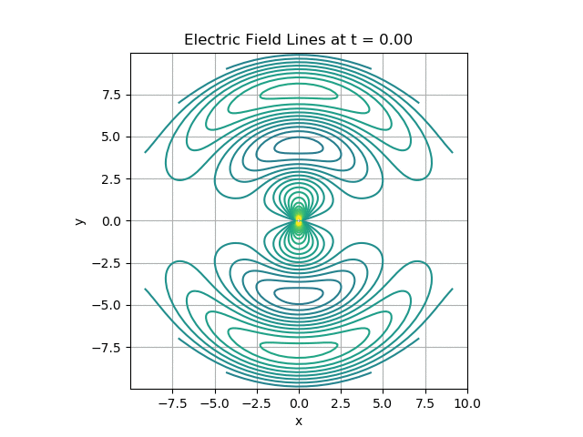

# Dipole Electric Field Lines Animation

This Python project visualizes and animates electric field lines of a idealized radiating dipole over time using an implicit solution for the field lines of the electric field of the form `f(r, θ, t) = C`. The contours of the function represent the electric field lines, and the animation shows how they change as the parameter `t` evolves.

## Features
- Contour plotting of electric field lines in polar coordinates, converted to Cartesian coordinates for visualization.
- Smooth animation of the field lines as a function of time (`t`), allowing users to observe their behavior over a range of time values.
- Customizable parameters for the function, contour levels, and animation speed.

## Requirements
This project requires the following Python libraries:
- `numpy`: For creating the grid of polar coordinates and performing numerical calculations.
- `matplotlib`: For plotting the contour lines and handling the animation.

You can install the dependencies using `pip`:
```bash
pip install numpy matplotlib
```

## How It Works
The code performs the following steps:

1. **Function Definition**: An implicit function `f(r, θ, t)` is defined. The implicit solution of the field lines was found in *Electromagnetic Waves and Antennas* by Orfanidis [1].
 This function describes the behavior of electric field lines, where `r` and `θ` are polar coordinates, `t` is time, and `C` represents constant contour levels.
   
2. **Grid Creation**: A polar coordinate grid `(R, Θ)` is generated using `numpy.meshgrid()`. This grid covers the space over which the function is evaluated.

3. **Contour Plotting**: The function values are computed over the grid, and contour lines are plotted at specific levels using `ax.contour()`. The polar coordinates are converted to Cartesian coordinates to visualize the electric field lines.

4. **Animation**: The `matplotlib.animation.FuncAnimation` class is used to create an animation by updating the plot for increasing values of `t`. At each time step, the contours (field lines) are redrawn based on the updated function values.

## Running the Code
To run the code and view the animation, simply execute the Python script:

```bash
python3 dipole_animation.py
```

This will display a window with an animated plot of the electric field lines over time.

### Saving the Animation
If you'd like to save the animation as a GIF or video file, you can uncomment the following lines in the code:

```python
# ani.save('electric_field_lines_animation.gif', writer='imagemagick', fps=10)
# ani.save('electric_field_lines_animation.mp4', writer='ffmpeg', fps=10)
```

Make sure you have either `imagemagick` or `ffmpeg` installed to save the output.

## Customization
You can easily customize the following parameters in the code:

- **Contour Levels**: Adjust the `contour_levels` array to control the number and spacing of the field lines.
- **Time Range**: Change the `t_values` array to extend or shorten the animation time range.
- **Animation Speed**: Adjust the `interval` parameter in `FuncAnimation` to control the speed of the animation.

## Example Output
The code generates an animation of electric field lines evolving over time, as shown below:



## References
[1] S. J. Orfanidis, *Electromagnetic Waves and Antennas*. Rutgers University, 2016. Available at: http://www.ece.rutgers.edu/~orfanidi/ewa/

## License
This project is open-source and available under the MIT License.
